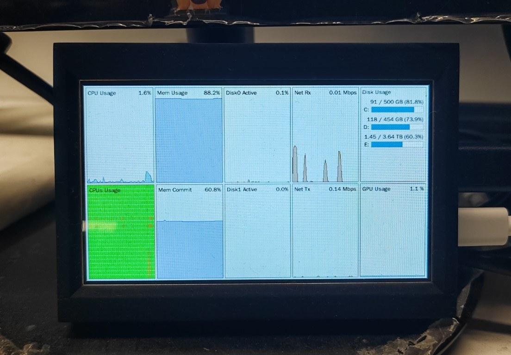

# Monitoring Dashboard

[English](README.md) | [简体中文](README.zh-CN.md)

A simple monitoring dashboard based on Tkinter, designed specifically for [windows_exporter](https://github.com/prometheus-community/windows_exporter). It supports running on low-power devices such as Raspberry Pi, enabling resource monitoring and visualization for Windows hosts.

## Features

- Real-time fetching of metrics from windows_exporter
- Supports monitoring of CPU, memory, disk, network, GPU, and more
- Historical data tracking and visualization
- Fullscreen mode, suitable for large screen displays
- Flexible configuration via command-line arguments and YAML file
- Runs on ARM devices like Raspberry Pi, perfect for DIY monitoring screens

## Preview




## Configuration

All configuration options can be set in the `config/config.yaml` file:

```yaml
url: "http://<windows_exporter_host>:9182/metrics"   # Prometheus windows_exporter address
fullscreen: false                                   # Fullscreen mode
title: "Monitoring Dashboard"                       # Window title
refresh_interval: 1.0                               # Refresh interval (seconds)
fetch_timeout: 0.5                                  # Fetch timeout (seconds)
history_length: 600                                 # History length (seconds)
```

You can also override some options via command-line arguments, for example:

```bash
python main.py --url http://your_exporter:9182/metrics --fullscreen
```

## Quick Start

1. Clone this repository to your local machine.
2. Install dependencies (if you have a `requirements.txt`, run `pip install -r requirements.txt`).
3. Configure `config/config.yaml`, set the `url` to your windows_exporter address.
4. Run the main program:

   ```bash
   python main.py
   ```

### Running on Raspberry Pi

On low-power devices like Raspberry Pi, it is recommended to use [PyPy3](https://www.pypy.org/) as the Python interpreter for better performance.

1. Install PyPy3 (refer to the [PyPy official documentation](https://www.pypy.org/download.html)).
2. Install dependencies with PyPy3:

   ```bash
   pypy3 -m ensurepip
   pypy3 -m pip install -r requirements.txt
   ```

3. Start the program with PyPy3:

   ```bash
   pypy3 main.py
   ```

## Main Dependencies

- Python 3.12+ or PyPy3
- tkinter
- requests
- pyyaml
- prometheus_client

## Project Structure

- `main.py`: Entry point, loads configuration and starts the main window
- `app/`: Core modules, including data collection, analysis, and visualization
- `config/`: Configuration files
- `images/`: Preview images

## Contact

If you have any questions or suggestions, feel free to open an issue or contact the author.
