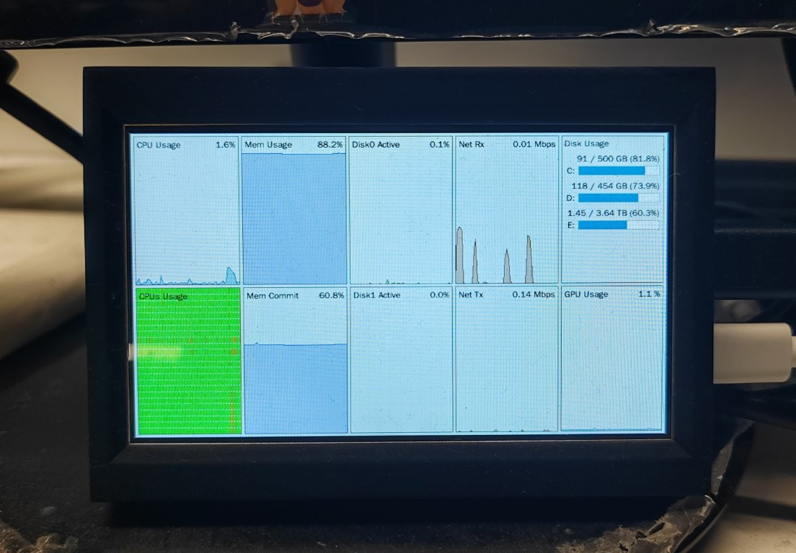

# Monitoring Dashboard

一个基于 Tkinter 的简易监控大屏，专为 [windows_exporter](https://github.com/prometheus-community/windows_exporter) 设计，支持在树莓派等低功耗设备上运行，实现对 Windows 主机的资源监控与可视化。

## 功能特性

- 实时拉取 windows_exporter 指标数据
- 支持 CPU、内存、磁盘、网络、GPU 等多种资源监控
- 历史数据追踪与可视化
- 支持全屏显示，适合大屏展示
- 配置灵活，支持命令行参数和 YAML 配置文件
- 可在树莓派等 ARM 设备上运行，适合 DIY 监控大屏

## 预览




## 配置说明

所有配置项均可在 `config/config.yaml` 文件中设置：

```yaml
url: "http://<windows_exporter主机>:9182/metrics"   # Prometheus windows_exporter 地址
fullscreen: false                                  # 是否全屏
title: "Monitoring Dashboard"                      # 窗口标题
refresh_interval: 1.0                              # 刷新间隔（秒）
fetch_timeout: 0.5                                 # 拉取超时（秒）
history_length: 600                                # 历史数据长度（秒）
```

你也可以通过命令行参数覆盖部分配置，例如：

```bash
python main.py --url http://your_exporter:9182/metrics --fullscreen
```

## 快速开始

1. 克隆本仓库到本地
2. 安装依赖（如有 requirements.txt，执行 `pip install -r requirements.txt`）
3. 配置 `config/config.yaml`，将 `url` 设置为你的 windows_exporter 地址
4. 运行主程序：

   ```bash
   python main.py
   ```
#### 在树莓派上运行

在树莓派等低功耗设备上，推荐使用 [PyPy3](https://www.pypy.org/) 作为 Python 解释器，可以显著提升程序运行效率。

1. 安装 PyPy3（可参考 [PyPy 官方文档](https://www.pypy.org/download.html)）
2. 使用 PyPy3 安装依赖：

   ```bash
   pypy3 -m ensurepip
   pypy3 -m pip install -r requirements.txt
   ```

3. 使用 PyPy3 启动程序：

   ```bash
   pypy3 main.py
   ```

## 主要依赖

- Python 3.12+
- tkinter
- requests
- pyyaml
- prometheus_client

## 代码结构简述

- `main.py`：程序入口，负责加载配置、启动主窗口
- `app/`：核心功能模块，包括数据采集、分析、可视化等
- `config/`：配置文件目录
- `images/`：存放预览图片

## 联系方式

如有问题或建议，欢迎提 issue 或联系作者。
